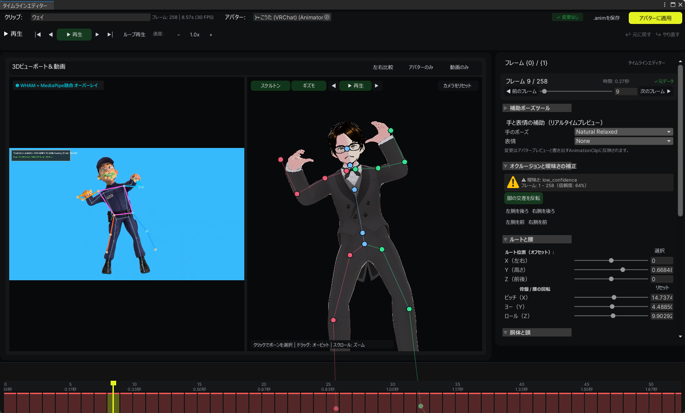

# ✨ TexMotion

[English](#english) | [日本語](#日本語)

---

<a name="english"></a>
# English

**TexMotion** is an AI-powered Text-to-Motion generation extension for Unity and VRChat avatars. By integrating native in-engine inference via [kimodo.cpp](https://github.com/localai-org/kimodo.cpp), TexMotion enables avatar creators to generate fluid, natural Humanoid 3D animations directly from natural language prompts, preview them in real-time within an interactive 3D viewport, and automatically bind them to VRChat avatars—either non-destructively using **Modular Avatar** or directly into **VRChat Expressions Menus & Action Layers**.

<p align="center">
  
</p>

---

## 🌟 Key Features

* **⚡ Native In-Engine AI Inference**: Runs lightweight C++ GGUF diffusion inference (`kimodo.dll` / `ggml-vulkan`) locally inside the Unity Editor with zero external Python runtime required.
* **🎥 Video-to-Motion & WHAM + MediaPipe 3D Fusion**: Extract 3D humanoid motion directly from any 2D video file (`.mp4`, `.mov`, etc.). Leverages state-of-the-art WHAM global lifting fused with MediaPipe keypoint detection for robust tracking even under severe limb crossing, occlusion, and stylized avatars.
* **⏱️ Motion Timeline & Frame-by-Frame Pose Editor**: Fine-tune generated motions with a dedicated visual timeline. Adjust joint Euler rotations, root offsets, copy/paste poses, mirror symmetry, smooth jitter with Slerp interpolation, and playback at variable speeds (0.1x - 2.0x).
* **🎬 Interactive 3D Motion Viewport**: Real-time 60fps 3D preview powered by `PreviewRenderUtility`, featuring orbit camera controls, zoom, timeline scrub, dynamic aspect-ratio fitting for vertical/horizontal videos, and synchronized side-by-side overlay.
* **🦴 Native Humanoid Muscle Curve Baking**: Converts SMPL-X22 diffusion motion data into Unity native 95-Muscle + RootT/Q curves via `HumanPoseHandler` for 100% universal compatibility across all avatar shapes and sizes.
* **🖐️ Hand Pose & Facial Emotion Assistance**:
  * **Hand Presets**: `Natural Relaxed`, `Fist`, `Open Palm`, `Peace`, `Point`, or `Keep Free`.
  * **Facial Emotion AI**: Automatically detects keywords (e.g. *smile*, *angry*, *wink*, *surprised*) from prompts and binds avatar blendshapes with customizable intensity.
* **🦊 Dual VRChat Setup Modes**:
  * **Modular Avatar (Non-Destructive)**: Automatically generates merge animators and menu items. If Modular Avatar is missing, TexMotion offers one-click automated UPM installation!
  * **Direct VRCSDK**: Directly writes into `VRCAvatarDescriptor`, `VRCExpressionsMenu`, and `VRCExpressionParameters` with automatic Action Layer weight controls and intelligent **NextPage** pagination for full menus (8/8 slots).
* **⚙️ Streamlined Categorized Settings**: Clean tabbed configuration divided into General, Text-to-Motion, and Video-to-Motion workflows for effortless setup and model management.
* **📚 Motion Library Manager**: Scan, preview, apply, or cleanly remove generated motions with full reversibility.
* **⬇️ One-Click Hugging Face Downloader**: Automatically downloads motion diffusion GGUF models, video backends, and text bundles from Hugging Face directly within the Editor.

---

## 🚀 Getting Started

### Requirements
* **Unity**: `2022.3.x` (or newer)
* **VRCSDK**: VRCSDK3 Avatar (`com.vrchat.avatars` 3.5.0+)
* *(Optional)* **Modular Avatar**: 1.9.0+

### Installation via VCC / Git URL (Package Manager)
1. In Unity, open **Window > Package Manager**.
2. Click the `+` button in the top-left and select **Add package from git URL...**.
3. Enter:
   ```text
   https://github.com/k0ta0uchi/TexMotion.git
   ```
4. Or import the `.unitypackage` from the [Latest Release](https://github.com/k0ta0uchi/TexMotion/releases).

---

## 📖 How to Use

1. Open **Tools > TexMotion > Motion Studio** from the Unity top menu.
2. Select your VRChat Avatar in the Hierarchy.
3. If models are missing, switch to **Settings & Models** and click **📥 Download Models from Hugging Face**.
4. Enter your motion prompt (e.g., `"a person throws a sharp right punch forward with energy"`).
5. Click **🚀 1. Generate Motion Preview** to inspect the motion in the interactive 3D viewport.
6. Click **✨ Apply to Avatar** to instantly bind the emote to your avatar!

### Video2Motion model assets

Open **Settings & Models > Video2Motion Model Assets** to choose a separate model
directory (default: `%APPDATA%/TexMotion/Models/Video`). RTMPose variants, DWPose
WholeBody, MediaPipe Pose Landmarker task files, and optional WHAM, HMR2, and
HybrIK quality checkpoints can be downloaded one at a time or with **Download
All**; **Source** links remain next to every entry for offline review and manual
provisioning. A WHAM download also installs the bundled
`texmotion_wham_adapter.py` bridge. Select the active backend from the
**Pose Estimation Backend** dropdown in the Video Motion tab; use the
**Video2Motion Inference** card in Settings for checkpoint, adapter, device, and
temporal frame cap details. The bridge automatically runs TexMotion's native
WHAM temporal core (the official MotionEncoder with local MediaPipe 2D input)
when the checkpoint is present, so no external WHAM repository is required for
the local 17-joint 3D lifting path. The `wham_vit_w_3dpw.pth.tar` file is a
state-dict only; it does not contain the optional official ViTPose/SLAM
preprocessing, image-feature integrator, SMPL decoder, or licensed SMPL assets.
Set `TEXMOTION_WHAM_ADAPTER_IMPL` only when selecting a full external WHAM
implementation for those stages. If the native core cannot load the checkpoint
or its auxiliary detector, extraction falls back to MediaPipe and records the
exact reason in the result card and Timeline Editor. The selected backend and
paths are persisted.

HMR2 uses the bundled `pose_pipeline/adapters/texmotion_hmr2_adapter.py`
bridge automatically; users do not need to author an adapter file. The
official 4D-Humans runtime, its checkpoint archive (`hmr2a_model.tar.gz` or
`hmr2_data.tar.gz`), and the separately licensed neutral SMPL `.pkl` remain
manual inputs. Install the upstream runtime into the selected PyTorch
environment, set **HMR2 Runtime**, **HMR2 Model**, and **HMR2 Body Model** in
Settings, run **Runtime Preflight**, and then select **HMR2** for extraction.
The bridge batches the complete frame sequence and reports the exact missing
asset or initialization error before the normal MediaPipe fallback.

The same Settings card exposes WHAM companion stages. ViTPose-Huge and DPVO
checkpoints have individual **Download/Redownload** actions and are passed to
the local WHAM adapter as `imageFeatureBackbonePath` and `dpvoModelPath`; a
ViTPose checkpoint still needs a local extractor or precomputed
`(frames, feature_dim)` archive, and a DPVO checkpoint still needs a local
runner to export per-frame camera poses. **Install Camera Template** creates a
`camera.yaml` starter file whose intrinsics must be replaced for the source
video. Licensed SMPL/SMPL-X body data remains a Browse-only asset. **Download
All** includes the public ViTPose/DPVO files and camera template while skipping
licensed body data.

Model references: [RTMPose ONNX](https://huggingface.co/bukuroo/RTMPose-ONNX),
[DWPose ONNX](https://huggingface.co/SceneWorks/dwpose-onnx), and
[MediaPipe Pose Landmarker](https://developers.google.com/mediapipe/solutions/vision/pose_landmarker),
[WHAM](https://github.com/yohanshin/WHAM), [HMR2 / 4D-Humans](https://github.com/shubham-goel/4D-Humans),
and [HybrIK](https://github.com/jeffffffli/HybrIK).

---

<a name="日本語"></a>
# 日本語

**TexMotion** は、自然言語テキストから高品質な 3D モーションを生成し、Unity および VRChat アバターへ即座に組み込むことができる AI モーション作成拡張機能です。[kimodo.cpp](https://github.com/localai-org/kimodo.cpp) のネイティブ推論エンジンを Unity 内に統合しており、Python 環境の構築不要でローカル高速推論を実現します。

<p align="center">
  
</p>

---

## 🌟 主な機能

* **⚡ Unity 内蔵ネイティブ高速推論**: `kimodo.dll` および `ggml-vulkan` による高速 GGUF 拡散推論を Unity エディタ内で直接実行。外部 Python 環境は一切不要です。
* **🎥 動画モーション抽出 & WHAM + MediaPipe 3D Fusion**: 手持ちの 2D 動画ファイル（`.mp4`, `.mov` 等）から高精度に Humanoid 3D モーションを抽出。WHAM のグローバル 3D リフティングと MediaPipe を融合し、足の交差や遮蔽（オクルージョン）があるシーンでも破綻のない安定したトラッキングを実現。
* **⏱️ モーションタイムライン & コマ送りポーズエディタ**: 生成したモーションを専用タイムラインエディタで直感的に微調整。関節ごとの Euler 回転や Root 移動の調整、ポーズのコピー＆ペースト、左右反転、Slerp 補間によるブレ除去、0.1x 刻みの変速再生に対応。
* **🎬 インタラクティブ 3D プレビュービューポート**: 縦型・横型動画の比率を自動維持するアスペクト比追従 RenderTexture、ドラッグによるカメラ 360 度回転、ホイールズーム、タイムラインシークバー、元動画との同期プレビューを完備。
* **🦴 完全な Humanoid Muscle（筋肉値）ベイク**: Unity 公式の `HumanPoseHandler` を採用し、SMPL-X22 の骨格データを 95 本の Muscle カーブ＋RootT/Q に変換。身長や体型を問わずあらゆる Humanoid アバターで 100% 確実に動作します。
* **🖐️ ハンドポーズ & 表情アシスト機能**:
  * **指ポーズプリセット**: `Natural Relaxed (自然な手)`、`Fist (グー)`、`Open Palm (パー)`、`Peace (ピース)`、`Point (指差し)`、`Keep Free (ハンドサイン連動)`。
  * **表情 AI 自動推論**: プロンプト内のキーワード（*smile*, *angry*, *wink*, *surprise* 等）から感情を推論し、アバターの BlendShape（MMD名/英語名）と自動連動。
* **🦊 選べる 2 つの VRChat セットアップ方式**:
  * **Modular Avatar 連携（非破壊）**: アバター直下にマージ用オブジェクトを自動生成。未導入時はワンクリックで UPM 自動インストールをサポート。
  * **Direct VRCSDK（直接登録）**: `VRCAvatarDescriptor`、`VRCExpressionsMenu`、`VRCExpressionParameters`、および Action Layer へ直接登録。メニューが満杯（8/8スロット）の場合はスマートな **NextPage ページネーション**（退避・復元・連鎖的折りたたみ）を自動実行。
* **⚙️ 整理された 3 カテゴリ設定 (Settings)**: 一般設定、テキストモーション生成、動画モーション抽出の 3 つにタブを再構成し、設定手順を最適化。
* **📚 モーションライブラリ管理**: 過去に生成したモーションの一覧表示、再プレビュー、アバターからの安全な一括削除・着脱。
* **⬇️ Hugging Face ワンクリックダウンローダー**: 必要なモデルデータ（GGUF および Text Bundle）をエディタ内から進捗バー付きで自動ダウンロード。

---

## 🚀 導入手順

### 必要環境
* **Unity**: `2022.3.x` 以降
* **VRCSDK**: VRCSDK3 Avatar (`com.vrchat.avatars` 3.5.0 以降)
* *(推奨)* **Modular Avatar**: 1.9.0 以降

### インストール方法（Git URL）
1. Unity メニューの **Window > Package Manager** を開きます。
2. 左上の `+` ボタンから **Add package from git URL...** を選択します。
3. 以下の URL を入力して追加します：
   ```text
   https://github.com/k0ta0uchi/TexMotion.git
   ```
4. または [Releases](https://github.com/k0ta0uchi/TexMotion/releases) から最新の `.unitypackage` をダウンロードしてインポートします。

---

## 📖 使い方

1. Unity 上部メニューの **`Tools > TexMotion > Motion Studio`** を開きます。
2. ヒエラルキー上の VRChat アバターを選択します。
3. モデルが未ダウンロードの場合は **Settings & Models** タブから **「📥 Download Models from Hugging Face」** を実行します。
4. プロンプト（例: `a dynamic hip hop dance routine`）を入力します。
5. **「🚀 1. Generate Motion Preview」** をクリックして 3D プレビューで動きを確認します。
6. **「✨ Apply to Avatar」** をクリックするだけで、アバターのエクスプレッションメニューへ即座にエモートが登録されます！

### Video2Motion モデルデータ

**Settings & Models > Video2Motion Model Assets** では、Kimodo とは分離した
モデル保存先（既定値: `%APPDATA%/TexMotion/Models/Video`）を指定できます。
RTMPose の各サイズ、DWPose WholeBody、MediaPipe Pose Landmarker の task
ファイルに加え、任意の WHAM、HMR2、HybrIK 品質チェックポイントを個別、
または **Download All** で一括取得できます。各行の **Source** リンクは残るため、
オフライン環境での確認や手動配置にも利用できます。WHAM をダウンロードすると
同梱の `texmotion_wham_adapter.py` ブリッジも自動で配置されます。Video Motion
タブの **Pose Estimation Backend** ドロップダウンで使用するバックエンドを選び、
**Video2Motion Inference** カードではチェックポイント、アダプター、デバイス、
時系列フレーム数を確認・設定できます。チェックポイントが存在すれば、ブリッジは
TexMotion 内蔵の WHAM 時系列コア（公式 MotionEncoder とローカル MediaPipe 2D 入力）を
自動実行するため、公式リポジトリを別途配置しなくても 17 関節の 3D リフティングを
利用できます。`wham_vit_w_3dpw.pth.tar` は重み（state-dict）のみで、任意の公式
ViTPose/SLAM 前処理、画像特徴統合、SMPL デコーダ、SMPL ライセンスデータは含みません。
これらの全ステージを使う外部実装を選ぶ場合だけ `TEXMOTION_WHAM_ADAPTER_IMPL` を指定
してください。ネイティブコアがチェックポイントや補助検出器を読み込めない場合は
MediaPipe にフォールバックし、具体的な理由を結果カードと Timeline Editor に表示します。
選択したバックエンドとパスは保存されます。Settings の WHAM Full-Parity
Companion Assets では、ViTPose-Huge と DPVO の **Download/Redownload**、カメラの
**Install Camera Template** を個別に実行できます。ViTPose の重みはローカル特徴抽出器
または `(frames, feature_dim)` の事前計算アーカイブが必要で、DPVO の重みはローカル
ランナーでフレームごとのカメラ姿勢を出力してから使用します。カメラテンプレートは
`camera.yaml` を作成しますが、入力動画の内部パラメータへ置き換えてください。SMPL/SMPL-X
のライセンスデータは Browse で手動配置します。**Download All** は公開されている
ViTPose/DPVO とカメラテンプレートを含み、ライセンスデータはスキップします。

HMR2 は `pose_pipeline/adapters/texmotion_hmr2_adapter.py` を同梱しており、
アダプター用の `.py` をユーザーが作成する必要はありません。公式 4D-Humans
ランタイム、チェックポイント（`hmr2a_model.tar.gz` または `hmr2_data.tar.gz`）、
およびライセンス済み中立 SMPL `.pkl` は手動で用意します。PyTorch 環境へ公式
ランタイムをインストールし、Settings の **HMR2 Runtime**、**HMR2 Model**、
**HMR2 Body Model** を指定して **Runtime Preflight** を実行した後、Video Motion
で **HMR2** を選択してください。ブリッジは全フレームをバッチ処理し、足りない
アセットや初期化エラーを表示してから MediaPipe へフォールバックします。

モデル参照: [RTMPose ONNX](https://huggingface.co/bukuroo/RTMPose-ONNX)、
[DWPose ONNX](https://huggingface.co/SceneWorks/dwpose-onnx)、
[MediaPipe Pose Landmarker](https://developers.google.com/mediapipe/solutions/vision/pose_landmarker)、
[WHAM](https://github.com/yohanshin/WHAM)、[HMR2 / 4D-Humans](https://github.com/shubham-goel/4D-Humans)、
[HybrIK](https://github.com/jeffffffli/HybrIK)。

---

## 📄 License
This project is licensed under the MIT License.
Native GGUF diffusion inference powered by [kimodo.cpp](https://github.com/localai-org/kimodo.cpp).
