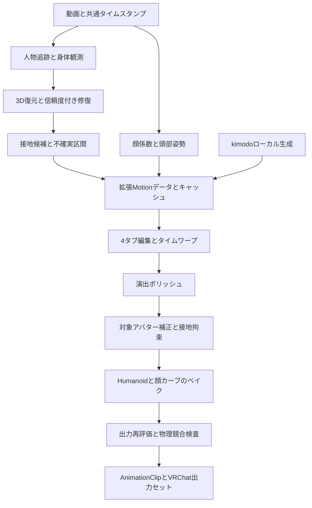

# 逆水寒の動画参照型ダンス生成を手掛かりとした TexMotion 機能提案

調査日: 2026-09-20 / 対象: TexMotion 1.4.0、Unity 2022.3 / コード確認基点: `240604b`

## 1. 結論と資料の扱い

最優先は、既存の接地検出・足ロック・時系列補正を、信頼度と編集可能なトラックを持つ一貫したパイプラインへ統合することである。続いて動画表情・頭部姿勢を追加し、対象アバターの骨長と形状に合わせた最終補正を行う。大規模Transformerやニューラルリターゲティングの導入は、これらの改善で解決できない事例を収集してから判断する。

提示された逆水寒の説明は、比較用の**参照アーキテクチャ**として扱う。I²R-Net、EA-RAS、TEACH、EmotionGesture、MoCap-Solver、3DStyFace、FDNを同ゲームの本番パイプラインで併用していること、クラウドGPUクラスタの具体的構成・性能について、提示文だけでは確認できない。研究技術として妥当な要素と、製品への採用が証明された事実は別であり、本書は逆水寒の内部実装を断定しない。資料検証の詳細は[一次資料調査](justice_online_primary_sources_20260920.md)を参照する。

本書の「実装済み」はソースコードを読んで確認した範囲を意味する。Unityでの実機動作、モデル重みの存在、GPU性能、公式WHAMと同等の推論品質まで実証したものではない。新規ファイル名・データ型・閾値・工数は設計提案である。

## 2. 現在の実装とギャップ

| 工程 | 提示資料の構成 | TexMotionで確認した実装 | 追加する価値 |
|---|---|---|---|
| 人物・2D観測 | 人体分離、関節検出 | MediaPipe、RTMPose系、PyTorch系バックエンド、観測信頼度・遮蔽状態 | 人物ID固定、カット検出、身体と顔の人物対応、検出領域の再利用 |
| 3D復元 | SMPL、6D回転、解剖学的制約 | SMPL-X22互換中間骨格、WHAM/HMR2アダプター、WHAM内部6D表現、Quaternion出力 | 形状・座標系・実行モデルの明示、対象体格の補正 |
| 時系列 | Transformer、平滑化、自己回帰予測 | SO(3)平滑化、交差・腕遮蔽の複数仮説、WHAM/MediaPipe融合、信頼度と不確実区間 | 長い欠損の扱い、固定キーを保持した補間、VFR対応、候補比較 |
| 接地・IK | 接地予測と拘束IK | Python自動接地・足ロック、接地ヒステリシス、Unity手動範囲ロック、Two-Bone IK | 接地トラック永続化、足裏・爪先の区別、体格適応、ポリッシュ後の再拘束 |
| 貫通防止 | 学習型リターゲティング | Humanoid変換、脇の最小開き角制限 | 実アバターの胴体・脚・頭部との距離拘束、意図した接触の保存 |
| 顔・頭部 | 顔BlendShape推定、表情と剛体姿勢の分離 | プロンプトから表情プリセット推定、名前によるBlendShape対応、身体骨格の頭部回転 | 動画由来の時間変化する表情、顔基準の頭部姿勢、個別マッピング |
| 出力・物理 | 回転カーブ配信と衣装物理の分離 | AnimationClip、Humanoidマッスル、Modular Avatar/Direct SDK | 身体・顔の同期出力、物理駆動骨の競合検出、ループ・加速度点検 |
| 運用 | 分散推論・UGC | EditorとPythonプロセス、GGUFローカル生成、バックエンド実行来歴 | 段階キャッシュ、停止・再開、設定とモデルの再現性、ローカル品質レポート |

### 2.1 接地は既存機能である

[video_pose_extractor.py](../Editor/Video/video_pose_extractor.py) の `apply_foot_locking` は床高の推定、足首の高さと速度による接地判定、接地区間のアンカー、境界ブレンド、膝のTwo-Bone IKを実装している。倒立や足の交差に対するガードもあり、`foot_lock=True` の経路で呼ばれる。単に「自動足ロックを追加」とすると既存機能を重複実装する。

[sequence_fit.py](../Editor/Video/pose_pipeline/sequence_fit.py) の `apply_foot_contact_hysteresis` はルート移動を加味した速度判定を持つ。ただし同メソッドは `self.dt` に基づき、床距離や足裏姿勢を統合した接地確率モデルではない。`apply_floor_snapping` の実処理は接地フレームのY下限補正であり、それ自体がXZの位置ロックではない。`compute_temporal_penalties` が診断エネルギーを計算できることと、すべてを同時に最小化する汎用最適化ソルバーがあることも区別する。

[EditableMotionData.cs](../Editor/Motion/EditableMotionData.cs) の `LockFootPosition` は指定範囲の先頭フレームの足首位置を固定する。`ApplyFootGrounding` はフレームごとのルート高さ補正なので、浮いた足をすべて接地させる設定を跳躍に適用すると動きを損なう。`GroundEntireClip` は全体の一定Yオフセットであり、この2つの用途は異なる。

[MotionIkUtility.cs](../Editor/Motion/MotionIkUtility.cs) のFKは標準的な骨オフセットを使う。Unity出力先の長脚・短脚・大きな靴の位置と一致する保証はない。現在の足ロックを実アバターでも保証するには、対象骨格での検証と補正が必要である。

### 2.2 顔・時間・出力の接続点

[VideoMotionData.cs](../Runtime/Motion/VideoMotionData.cs) は時刻、フレーム・関節信頼度、不確実区間、実バックエンドとフォールバックの来歴を持つ。一方、この型と[VideoMotionJobRunner.cs](../Editor/Video/VideoMotionJobRunner.cs) の確認範囲では、編集可能な接地イベント・連続表情トラックの明示的な契約は見当たらない。

[FaceEmotionHelper.cs](../Runtime/Motion/FaceEmotionHelper.cs) は動画顔推定器ではなく、プロンプトのキーワードからプリセットを決め、顔メッシュのBlendShape名を照合する補助機能である。[AnimationClipBuilder.cs](../Editor/Motion/AnimationClipBuilder.cs) は対象アバターの複製に骨回転を適用し、`HumanPoseHandler` でマッスルを取得する。マッスル数は95固定配列ではなく `HumanTrait.MuscleCount` を使うため、新機能でもこの方針を維持する。

[StylizedMotionPolisher.cs](../Editor/Motion/StylizedMotionPolisher.cs) は誇張、コントラポスト、軌道平滑化、連鎖遅延、着地クッション、オーバーシュート、Snap & Ease、キー削減、コマ打ちの9処理を持つ。接地後に骨盤や脚を変更する処理があるため、接地制約を後段まで保持する設計が必要になる。

## 3. 優先度と実現可能性

| 優先度 | 提案 | 再利用できる実装 | 新規負担・実現性 | 判断基準 |
|---|---|---|---|---|
| P0 | 接地データ契約と自動補正の統合 | Python接地、Two-Bone IK、修復UI | 中 / 高 | 跳躍を保ち、接地区間の滑りを減らす |
| P0 | 共通時刻・編集履歴・品質比較 | Timestamps、信頼度、Undo | 中 / 高 | 身体・顔・接地の編集後同期 |
| P1 | Face Landmarker表情と頭部同期 | Python実行、BlendShape出力 | 中 / 高 | 小顔・横顔時に誤出力を抑える |
| P1 | 信頼度付き短欠損補間と平滑化 | SO(3)、仮説評価、GlitchDetector | 小〜中 / 高 | 既知フレームと動作ピークを保持 |
| P1 | 体格適応IK・簡易形状の貫通防止 | Avatar複製、FK、Humanoid変換 | 中〜大 / 中 | 複数体格で改善し意図した接触を残す |
| P2 | 物理協調出力・再生診断 | Clip生成、VRChat設定 | 中 / 中〜高 | 二重駆動を検出、ループ境界を点検 |
| P3 | 学習型長欠損補完・形状分離モデル | オプション推論基盤 | 大 / 研究段階 | 軽量基準を上回り配布条件を満たす |

## 4. P0: 接地トラックと対象アバター上の足裏ロック

### 4.1 判定を統一し、誤接地を制御する

既存2系統の接地判定を共通サービスへ整理する。Pythonでは世界座標相当の足速度、床距離、観測信頼度、身体の向きから候補を作る。WHAMの接地出力が実際に取得できる場合はモデル予測も入力に加えるが、未実行ステージの値や意味不明な配列を接地確率として採用しない。チャネルの左右・爪先・踵の対応をアダプターで明示する。

速度は `Δp / Δtimestamp` で計算する。ルート相対位置にはルートを一度だけ加え、既に世界座標のデータには加算しない。カメラ移動が未補正の場合は「世界接地」の信頼度を下げる。単眼の床高と絶対スケールには不確実性があるため、床面指定と身長基準の補正を残す。

ヒステリシスに最低持続時間を加え、「接地」「離地」「不明」を分ける。初期実験値として進入0.7・退出0.4の確率閾値、80〜120ms程度の持続時間を候補とするが、これは未較正値である。空中で静止する足は速度だけでロックしない。床面が変わる段差・階段・移動床は最初のリリースでは手動領域指定とし、自動的に単一平面へ潰さない。

### 4.2 アンカーとIK

接地区間の信頼できる観測の中央値からアンカーを決める。足首のみでなく足裏中心・爪先・踵のオフセットをAvatarプロファイルに持たせ、通常接地、爪先立ち、軸足回転を区別する。ピボットでは足裏の接触点を保持しつつYawを許容し、完全な回転固定でダンスのターンを止めない。

対象アバターの実骨長を使ってTwo-Bone IKを解き、膝の曲げ方向を前フレームから連続化する。両足拘束が届かない場合は骨盤補正量に上限を置き、低信頼側の拘束を緩和する。脚を伸縮させて成立させず、残差を表示する。接地開始・終了には時間ベースの重みカーブを使う。

Pythonの補正済みポーズをさらに無条件で二重補正しない。Pythonは観測に基づく候補・元の姿勢・補正来歴を保持し、Unityは対象骨格で必要な最終補正を担当する。既存の手動範囲ロックも残し、ユーザー指定区間を自動判定より優先する。

### 4.3 ポリッシュとの整合

推奨順序は「観測修復 → タイミング編集 → 演出ポリッシュ → 対象骨格への変換 → 接地・貫通の最終拘束 → マッスル取得 → カーブ削減 → 出力再評価」とする。これは新しい評価パイプラインの順序であり、既存ポリッシャーの全処理がこの順序を満たしているという意味ではない。

着地クッションは共通の接地開始イベントを使い、跳躍中に反応させない。脚の遅延・誇張は接地中の重みを下げる。コマ打ちと連続IKは衝突するため「足は連続保持／全身を段階化」を選べるようにし、どちらも最終Clipの足位置を再評価する。キー削減では接地開始・終了と固定ポーズを必須キーとして保持する。

## 5. P1: 動画表情と頭部姿勢の同期

### 5.1 推定方式

初期導入は既存Python環境にMediaPipe TasksのFace Landmarkerを追加する。従来のFace Meshで得たランドマークだけから全BlendShapeが直接得られるとは扱わず、BlendShape出力と顔変換行列を有効化する。APIの出力項目は[公式Face Landmarker資料](https://ai.google.dev/edge/mediapipe/solutions/vision/face_landmarker/python)で確認できる。

身体検出と共通の動画時刻・人物IDを使う。複数人物では身体の頭部領域と顔位置を対応させる。顔が小さい、横を向く、遮蔽される場合は欠測にし、短時間だけ保持してからニュートラルへ戻す。顔だけ別人へ切り替わる現象を禁止する。

ニュートラル区間で基準表情と頭部向きを較正する。顔変換行列から剛体回転成分を取り出し、カメラ系から身体推定系への基底変換を明示する。頭部の絶対姿勢を親のNeck/Spine姿勢でローカル化してから、身体側の頭部推定と信頼度で合成する。既存の頭回転に同じ回転を加算して二重に回さない。左右反転表示、入力動画のミラー、行列の行列優先順序・座標の利き手を個別に検証する。

### 5.2 アバターへのマッピング

`FaceMappingProfile` に入力チャネル、Renderer相対パス、BlendShape名、係数、デッドゾーン、上限、左右反転を保存する。推定係数0〜1からUnityの通常0〜100への倍率はプロファイルで扱う。52係数が任意のVRChatアバターに52個存在する前提にはしない。左右別の笑顔を単一の笑顔Shapeへ合成する場合も明示する。

名称による自動候補提示は現行ヘルパーを再利用するが、ユーザーが確認した対応だけを確定する。複数顔メッシュ・まつ毛・歯にも対応できるよう、最初に見つけたRendererだけへ固定しない。眉・目・口を個別に無効化でき、表情プリセットは動画表情の上書きか加算かを選べるようにする。

### 5.3 VRChatとの競合

身体Humanoidカーブと顔BlendShapeカーブを内部的に分離し、同じ開始時刻・長さ・速度の出力セットとして保存する。VRChatでは身体Action、顔FXを基本案とし、既存Modular Avatar/Direct SDKの両経路に同じ同期規則を実装する。顔トラッキング、まばたき、リップシンク、ジェスチャー表情との優先権を明示し、動画再生終了時に状態を戻す。

[Playable Layers公式資料](https://creators.vrchat.com/avatars/playable-layers/)を実装時に照合し、マスクやTracking Controlの影響を対象SDKで確認する。頭部を動画に固定するかHMD追従を優先するかは独立した出力設定にする。ネットワークで52係数を逐次送る方式は不要で、事前ベイクされたClipと既存メニュー操作を使う。

## 6. P1〜P3: 遮蔽補完と平滑化

### 6.1 軽量基準を先に整える

既存 `observations.py` のOBSERVED/OCCLUDED/PREDICTED相当の区別、関節信頼度、`UncertaintyIntervals`を保持する。補間したフレームの観測信頼度を1へ書き換えず、観測確度と補完方式を別項目にする。

短い欠損は時刻に基づく位置補間とQuaternion SLERPで埋める。例として0.2秒以下を短欠損の初期分類とし、動きの速さに応じて変更する。より長い区間は前後の速度と骨長・関節制限を使う拘束付き補間を比較する。両端がない区間や長い遮蔽は「復元確定」とせず、保持・手動キー・生成候補を選ぶ。

現在のSO(3)平滑化を基準に、信頼度適応の平滑化を比較する。Euler角の単純平均は避け、Quaternion符号連続性と正規化を維持する。オフライン処理では前後方向のフィルターで位相遅延を抑え、ピーク速度・着地イベント・固定キーを保護する。身体のノイズ除去と手付け風ポリッシュは別パラメーターとする。

### 6.2 Transformerと生成補完の導入条件

Spatial-Temporal Transformerはモデル名ではなく構造の分類である。2D-to-3D lifting、3D姿勢のdenoise、欠損区間のin-fillingは異なる入出力・学習目的を持つため、既存モデルを差し替えるだけでは実現しない。候補選定では入力骨格、時間窓、マスク条件、ルート座標、学習分布、重みの利用条件を先に確認する。

TEACH等のテキストから連続動作を生成する研究は、観測動画の隠れた振付を忠実に復元する証拠にはならない。生成候補には「原映像から確認できない推定」と表示し、固定した両端と接地イベントへの適合度を示す。実際には見えない動作の真値を保証しない。

kimodo.cpp側の `constraintCfg` の存在だけで任意フレームのマスク付きinpaintingが利用可能と推定しない。現在の `KimodoInferenceEngine.Generate` の公開引数・ネイティブABI・対応モデルの条件入力を別途確認し、未対応なら機能追加を独立案件にする。GGUFは既存モデルの格納・推論経路であり、任意のPyTorchモデルを無改造で動かす共通形式ではない。

## 7. P1: 体格差と貫通防止

`AvatarRetargetProfile` にHumanBodyBones対応、レスト姿勢、骨長、足裏、胴体・骨盤・頭のカプセル形状、関節制限を保存する。スケールやAvatarの変更時はキャッシュを失効させる。全身の身長比だけでなく脚長・腕長を使い、足の接地点や手の到達位置という動作意図を優先する。

最初は手首/前腕対胴体、両脚、足対床の簡易距離拘束を対象にする。カプセルの貫通量を小さなIK補正へ変換し、観測ポーズとの差を抑える。腕組み、胸に手を当てる、拍手などは意図した接触として除外指定できるようにする。衣装の膨らみは補助カプセルまたは余白値で調整する。

既存の脇角度リミッターは軽量な初期防御として維持するが、任意メッシュの貫通解決とは表示しない。毎フレームの高密度メッシュ衝突やSDF構築は第1段階に含めない。MoCap-Solverのような学習型方式は入力の前提がTexMotionの動画推定骨格と一致するとは限らず、データ収集・再学習なしの即時代替として扱わない。

## 8. P2: 衣装・髪の物理との協調

出力は身体モーションを中心にし、髪・スカートなど物理が担当するTransformへのカーブ書き込みを検査する。VRChat PhysBonesは髪や衣装等の二次運動を担当し、アニメーションと組み合わせる場合は `Is Animated` 等の設定が関わるため、単純な「全骨をベイクして再生」ではない。[PhysBones公式資料](https://creators.vrchat.com/common-components/physbones/)

「物理を維持」を標準、「Unityの特定環境で二次運動をベイク」を将来オプションとする。後者は固定dt、ウォームアップ、使用ソルバー、初期状態を記録し、VRChat実機と同一になるとは保証しない。Play ModeプレビューとSDK環境での確認を分ける。

身体の角速度・角加速度、骨盤の急変、ループ境界の位置・速度差を診断する。高い値を検出しても自動的に全て平滑化せず、ユーザーが演出を維持するか選ぶ。PhysBone設定や衣装物理コンポーネントを無断で書き換える設計にはしない。

## 9. ローカルアーキテクチャ

### 9.1 責務と候補ファイル

| 場所 | 既存責務 | 拡張案（新規名は仮称） |
|---|---|---|
| `Editor/Video/pose_pipeline/` | 観測、復元、融合、時系列 | `contact_detection.py`、`face_pipeline.py`、`temporal_repair.py`。既存関数を共通化し来歴も出力 |
| `Editor/Video/VideoMotionJobRunner.cs` | PythonジョブとJSON入力 | 段階進捗・キャンセル、拡張DTO、サイズ・有限値・時刻検証 |
| `Runtime/Motion/` | データ、骨格定義、表情補助 | `ContactTrack`、`FaceTrack`、`MotionProvenance`等の軽量データ。PythonやEditor APIへ依存させない |
| `Editor/Motion/` | 編集、IK、ポリッシュ、Clip | `ContactConstraintSolver`、`AvatarRetargetProfile`、`MotionQualityEvaluator`、顔カーブ出力 |
| `Editor/VRChat/` | MA/Direct設定 | 身体・顔Clipセットの同期、競合診断、停止後の復帰 |
| `Editor/TexMotionSettings.cs` | 共通設定 | 顔処理、品質モード、キャッシュ、実行デバイス、モデル来歴 |
| `Runtime/Native/` | kimodoネイティブ推論 | 原則現状維持。学習補完が必要な場合のみ明示的ABI拡張 |

`HumanPoseHandler` はAvatarのHumanoid姿勢の取得・設定を担うAPIなので、対象複製に補正を適用してから取得する現在の構造を活用できる。[Unity 2022.3 API](https://docs.unity3d.com/2022.3/Documentation/ScriptReference/HumanPoseHandler.html)

### 9.2 データ契約と互換性

既存ルート位置・Quaternion配列は維持し、トップレベル契約のバージョンと任意の拡張ブロックを導入する。既存 `BackendMetadata.SchemaVersion` と同じ意味の番号にしない。

- `contactTrack`: 左右、開始/終了時刻、確率またはunknown、接触モード、アンカー座標系、床面、検出器、手動上書き。
- `faceTrack`: 時刻、チャネル名と値、頭部姿勢、顔の有効性・信頼度、人物ID、較正情報。
- `repairProvenance`: 観測/補間/生成の区別、固定キー、手法、適用区間、設定ハッシュ。
- `avatarProfileRef`: アバター識別子、骨格・マッピングのハッシュ。原観測データを対象体格で上書きしない。

旧JSONは拡張なしとして読み込む。接地欠落は「全て非接地」ではなく「未解析」、顔欠落は「既存表情出力のまま」とする。`JsonUtility`に合わせて辞書依存を避ける。NaN、重複・逆転時刻、配列長、Quaternion正規化を境界で検査する。

身体と顔の推定fpsが異なっても元動画時刻で関連付ける。時間編集は共通の `sourceTime → editedTime` を通し、トリム、速度変更、逆再生、ループで接地イベントと顔も変換する。鏡像編集では骨格だけでなく左右顔係数・接地ラベル・アンカー座標も変える。Undo/Redoと保存は全トラックをひとつの編集単位として扱う。

### 9.3 軽量実行とモデル選定

| モード | 推奨構成 | 用途と条件 |
|---|---|---|
| 標準CPU | MediaPipe身体/顔、NumPy時系列、Unity解析IK | まず常時利用可能な基準を作る。推論fpsは実測して表示 |
| 任意GPU | 既存RTMPose/ONNX系バックエンド、PyTorch WHAM/HMR2 | インストール済み資産・実行可能デバイスがあるときだけ選択 |
| 実験 | 小型TCN/TransformerのONNX化またはPyTorch | 長欠損コーパスで比較し、精度・メモリ・ライセンスの条件を満たしたものだけ配布 |

ONNX RuntimeにはCPUや複数GPU向けExecution Providerがあるが、全モデル・演算が全Providerで動くわけではない。まずPython側で既存環境を使い、Unityネイティブ推論の追加は起動時間や配布サイズの実測で必要性が出てから行う。[ONNX Runtime公式資料](https://onnxruntime.ai/docs/execution-providers/)

CPUモードはRAM 16GB級を初期評価機、任意GPUモードはVRAM 8GB級を初期評価機の例とし、必要最低仕様とは断定しない。30秒/30fps・1080p入力と縮小入力を比較し、総時間、推論時間、最大RAM/VRAMを測る。顔は身体ROIと動画デコードを再利用し、長尺は重なり付き区間に分割して人物ID・ルート・フィルター状態を引き継ぐ。

動画ハッシュ、モデル/重みハッシュ、設定、座標系、パイプライン版で段階キャッシュを識別する。顔マッピング変更では動画を再推論せず、ポリッシュ変更では身体観測を再計算しない。中断時は未完了キャッシュを有効扱いせず、完了区間のみ再利用する。モデル本体・重み・人体モデル・学習データの権利は別々に確認し、研究用ライセンスの資産を商用配布へ混入させない。

## 10. 4タブとワークフローへの統合

5つ目のトップレベルタブを直ちに増やさず、現在の[TimelineWorkspaceState](../Editor/Motion/TimelineWorkspaceState.cs)と各Panelを拡張する。

| UI | 追加する操作 | 表示と適用範囲 |
|---|---|---|
| ポーズ | 顔・頭部サブパネル、左右係数、ニュートラル較正、固定キー | 現在フレーム/選択区間。対象Rendererと未対応Shapeを明示 |
| 修復 | 既存Foot Grounding & Contactに「自動検出」「接地候補を適用」 | 左右接地帯、unknown、足裏アンカー、残差。既存手動ロックも保持 |
| 修復 | 遮蔽候補比較、短欠損補間、体格・貫通補正 | 変更前後の重ね表示、観測/補間/生成の色分けとテキスト表示 |
| タイミング | 身体・顔・接地を共通時間で編集、顔オフセット調整 | 秒表示と元動画時刻。意図的に同期を外した場合は明示 |
| ポリッシュ | 「接地を保持」「固定キーを保持」、物理負荷の診断 | 演出強度と修復強度を分け、結果をA/B比較 |
| Settings | 品質モード、顔解析、モデル資産、デバイス、キャッシュ | 要求バックエンドと実行バックエンドを区別 |
| 出力画面 | 身体/顔セット、頭部制御、物理維持、対象Avatar | マッピング未解決、同期差、接地残差を一覧化 |

修復タブの基本操作は「解析 → 候補を見る → 選択範囲へ適用 → 元に戻す」とする。重い推論をスライダー操作ごとに実行せず、結果キャッシュからプレビューする。タイムライン下部に左右接地と顔有効性を折りたたみ可能なトラックとして追加し、問題区間へジャンプできるようにする。色だけに依存せず「観測」「補間」「未確認」の表示を添える。

初回は「動画を選択 → 人物を確認 → 身体/顔を解析 → 問題区間を修復 → Avatarを選択・較正 → ポリッシュ → 出力検証」と進む。顔が映っていない動画は身体のみで完了でき、顔モデル未導入で身体抽出を失敗させない。

## 11. 実装ロードマップ

工数はUnity/Pythonを扱える開発者1名の概算であり、モデル再学習・大規模データ収集を含まない。段階ごとの評価結果で再見積もりする。

| 段階 | 目安 | 成果物 | 次へ進む条件 |
|---|---|---|---|
| 0: 基準測定 | 3〜5日 | 評価動画、現在の出力と指標、座標・時刻契約 | Python/Unity間の再現性、既存2系統接地の差を説明できる |
| 1: 接地統合 | 2〜3週 | 接地DTO、共通検出、修復トラック、対象骨長IK | 滑り改善と跳躍保持、旧JSON互換、Undo成立 |
| 2: 顔と短欠損 | 2〜3週 | 顔抽出、マッピング、同期編集、補間 | 未検出の安全な扱い、元動画との時刻一致、出力曲線一致 |
| 3: 体格・物理 | 2〜4週 | Avatarプロファイル、簡易貫通補正、物理競合診断 | 複数Avatarと両VRChat導入経路で検証 |
| 4: 学習補完評価 | 2〜4週の調査枠 | 軽量モデル比較・採否記録 | 基準手法を上回る根拠、重み配布条件、PC負荷が許容範囲 |

段階1を最初のリリース単位にする。段階4は実装を約束する工程ではなく、導入しない結論も許容する評価工程である。

## 12. 評価と受け入れ条件

静止、歩行、左右ステップ、軸足回転、爪先立ち、ジャンプ、脚交差、腕組み、手を頭の後ろへ回す動き、倒立、画面外、カメラ移動、カット、VFRを含む動画セットを固定する。標準・長脚・短脚・大きな靴・衣装の厚いAvatarを使い、モデル/設定/ハードウェアを記録する。

| 項目 | 測定 | 初期受け入れ目標（未実測） |
|---|---|---|
| 接地 | 人手ラベルとのprecision/recall、接地中の足裏XZ速度・変位 | 跳躍の誤接地を増やさず、既存比で滑り中央値30%以上低減を目安 |
| 接地拘束 | 対象Avatar上の床侵入量、最大到達残差 | 平地の通常接地で足裏誤差1〜2cm級を目標。体格別に報告 |
| 動作保持 | 跳躍頂点高さ、ターン角、ピーク速度 | 滑り改善と併せて比較し、全身静止による見かけの改善を除外 |
| 顔同期 | まばたき・口開閉ピークの動画との差 | 出力サンプリングの1フレーム以内を同期系の目標。推定誤差は別計測 |
| 補間 | 既知フレームを人工マスクした再構成誤差 | 単純SLERP基準より改善し、固定キーと正常区間を変更しない |
| 貫通 | 簡易形状の侵入量と映像確認 | 意図した接触を保持して悪化区間を減らす。衣装は別に判定 |
| 編集 | トリム/速度/逆再生/ミラー/Undo後の全トラック整合 | データ破損なし、再保存後も同じ結果 |
| 出力 | ベイク後Clipを再サンプルした足・顔・ループ | 内部プレビューだけでなく最終カーブで合格 |
| 環境 | CPU/GPU別の時間・RAM/VRAM、キャンセル復帰 | 未導入モデルでも選択可能な代替経路と正しい来歴表示 |

Pythonでは既存 `Editor/Video/tests/` に座標・VFR・接地イベントの契約テストを追加する計画とする。Unityでは既存 `tests/` に拡張DTOの旧版互換、足裏拘束、顔カーブ、Undoと時間変換の回帰テストを置く。MA/Direct SDKは実プロジェクトで同一Clipセットの再生・停止・追従復帰を確認する。本提案書作成ではコード変更もこれらのテスト実行も行っていない。

## 13. 採用判断

TexMotionは動画姿勢推定・時系列補正・IK・Humanoid化の基礎をすでに持つ。逆水寒の参照構造から得るべき要点は、個々の研究モデル名を増やすことより、観測品質、接地、顔、対象骨格、物理を同じ時間軸で結ぶことである。

最初の開発対象を「接地トラックの保存と編集」「対象骨格での最終拘束」「共通時間軸」の3点に固定すれば、既存ポリッシュの品質も改善できる。その上で顔推定を追加し、長欠損モデルと学習型リターゲティングは測定可能な改善と利用条件が揃った場合に進める。

## 付録A. 参照資料の技術名をそのまま実装仕様にしないための補正

一次資料調査から、提示された各要素は次のように読み分ける必要がある。詳細なURL・利用条件は[一次資料調査](justice_online_primary_sources_20260920.md)に整理した。

| 名称 | 一次資料が扱う課題 | 本提案への反映 |
|---|---|---|
| I²R-Net | 人物内・人物間関係を使った複数人物2D姿勢推定 | 人体領域のセグメンテーション専用モデルと同一視しない |
| EA-RAS | 単一画像から解剖学的骨格・表面モデルを推定 | Humanoidリターゲットや時系列ダンス補完の完成品とは扱わない |
| FDN | RGB画像から頭部姿勢を推定 | 微小表情のBlendShape推定まで実現する根拠とはしない |
| MoCap-Solver | 光学マーカーからのノイズ除去と骨格動作復元 | 任意のRGB動画骨格を受ける汎用リターゲットとして即時導入しない |
| TEACH | 文章列を条件に動作を時系列合成 | 観測動画の遮蔽補完とは入出力・評価を分ける |
| 3DStyFace | 今回の調査では正式な一次資料を同定できず | 対応機能を断定せず、顔取得は確認できたMediaPipe APIで設計 |
| EmotionGesture | 提示名に対応する一次資料・モデル版は本調査では未検証 | 自己回帰補完器として採用済み・導入可能と扱わない |
| Motion-Smooth損失 | 提示資料に式・重み・対象論文の特定なし | 本書では速度・加速度・回転連続性の明示的な評価量として再設計 |

6D回転はニューラルネットの回転回帰で使う表現であり、それだけで骨格の解剖学的正しさや時系列の安定性が保証されるわけではない。WHAMアダプター内の6Dと編集・出力のQuaternionは役割が異なるため、既存の中間表現を一律6Dへ置き換える必要はない。

クラウドとクライアントの分離からは「重い推定と軽い再生を分ける」設計を採用できる。TexMotionでは前者をローカルPython/Editor、後者をAnimationClipとVRChatの既存再生系が担うため、独自のクラウドGPU・回転カーブ配信サービスを新設する必要はない。UGCの価値は、プロファイル・プリセット・来歴付きClipを保存して再編集できる形で取り入れる。
