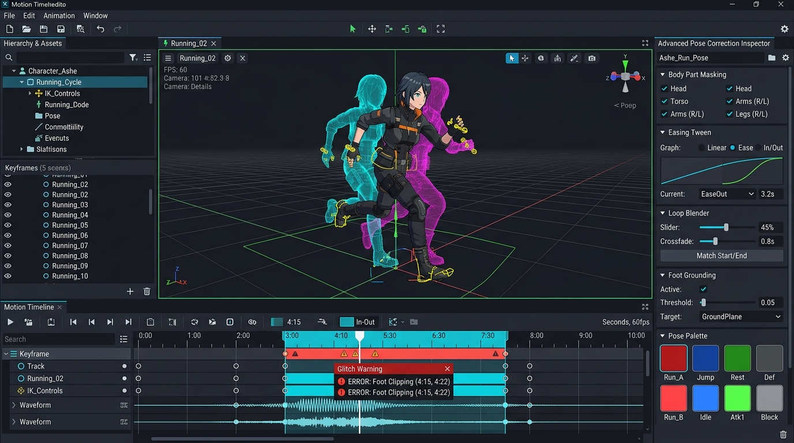
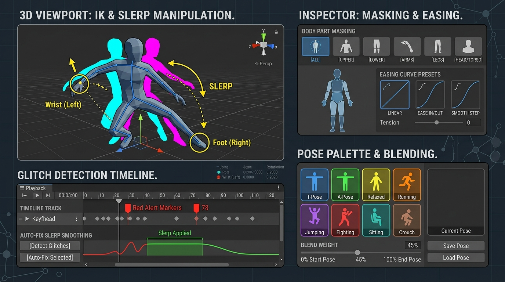

# タイムラインエディタ 高度ポーズ修正ガイド / Advanced Pose Correction Guide

本ドキュメントでは、TexMotion のタイムラインエディタ（`MotionTimelineEditorWindow`）に搭載された高度ポーズ修正機能の動作原理、操作手順、および技術仕様を解説します。

---

## 目次 / Table of Contents

- [日本語ガイド](#日本語ガイド)
  - [1. 概要](#1-概要)
  - [2. ビューポート支援ツール](#2-ビューポート支援ツール)
    - [2.1 3D オニオンスキン表示](#21-3d-オニオンスキン表示)
    - [2.2 3D ビューポート 2-Bone IK 操作](#22-3d-ビューポート-2-bone-ik-操作)
  - [3. 範囲設定と部位別マスク](#3-範囲設定と部位別マスク)
    - [3.1 In / Out 区間指定](#31-in--out-区間指定)
    - [3.2 部位別マスク](#32-部位別マスク)
  - [4. 時間軸・キーフレーム編集](#4-時間軸キーフレーム編集)
    - [4.1 範囲補間（キーフレーム・トゥイーン）](#41-範囲補間キーフレームトゥイーン)
    - [4.2 リタイミング（区間の伸縮）](#42-リタイミング区間の伸縮)
    - [4.3 ループ境界ブレンダー](#43-ループ境界ブレンダー)
  - [5. 姿勢調整と幾何制約](#5-姿勢調整と幾何制約)
    - [5.1 アディティブ範囲オフセット](#51-アディティブ範囲オフセット)
    - [5.2 脇部・胸部めり込み防止リミッター](#52-脇部胸部めり込み防止リミッター)
    - [5.3 地面接地スナップと足位置固定](#53-地面接地スナップと足位置固定)
  - [6. 品質検査とワークフロー支援](#6-品質検査とワークフロー支援)
    - [6.1 異常フレーム・ジッター自動検出と一括修復](#61-異常フレームジッター自動検出と一括修復)
    - [6.2 ポーズパレットとブレンド適用](#62-ポーズパレットとブレンド適用)
- [English Guide](#english-guide)
  - [1. Overview](#1-overview)
  - [2. Viewport Assistance Tools](#2-viewport-assistance-tools)
  - [3. Range Selection & Body Part Masking](#3-range-selection--body-part-masking)
  - [4. Temporal & Keyframe Editing](#4-temporal--keyframe-editing)
  - [5. Pose Adjustment & Geometric Constraints](#5-pose-adjustment--geometric-constraints)
  - [6. Quality Assurance & Workflow Helpers](#6-quality-assurance--workflow-helpers)

---

# 日本語ガイド

## 1. 概要

動画からの姿勢推定処理（HMR2 / WHAM / ViTPose）では、被写体の遮蔽、高速移動によるブレ、または視覚的なあいまいさに起因して、関節角度の急激な跳躍や四肢のめり込みが発生することがあります。TexMotion は、推定された 3D モーションデータを Unity 上で直感的に調整するための専用タイムラインエディタを備えています。

本エディタには、単一フレームの関節角度調整にとどまらず、複数フレームにまたがる補間、骨格幾何に基づく逆運動学（IK）操作、物理的接触やループ処理を支援する計11種類の高度修正ツールが統合されています。

---

## 2. ビューポート支援ツール

### 2.1 3D オニオンスキン表示
手動修正を行う際、前後フレームとの連続性を視覚的に確認できない状態では、滑らかな軌道を作り出すことが困難になります。オニオンスキン機能は、現在のフレームの前後に位置する姿勢を半透明のゴーストメッシュとしてビューポート上に重畳描画します。

- **表示仕様**:
  - 直前フレーム（Frame - 1）: シアン色（水色）の半透明シルエットで描画されます。
  - 直後フレーム（Frame + 1）: マゼンタ色（赤紫色）の半透明シルエットで描画されます。
- **操作手順**:
  1. ビューポート上部の HUD にある「🧅 Onion」ボタンを押下して有効化します。
  2. タイムラインスライダーを移動させると、前後の姿勢差が色分けされて表示されます。

### 2.2 3D ビューポート 2-Bone IK 操作
腕や脚の末端（手首・足首）を目標位置へ移動させたい場合、肩・肘・手首の3関節を個別に回転させる手法は調整コストが高くなります。本機能は、ビューポート上に操作用ピンを提示し、ドラッグ操作によって解析的 2-Bone IK（2関節逆運動学）を計算して関節角度へ反映します。

- **対象関節**:
  - 左手首（`SmplxJoint.L_Wrist`）、右手首（`SmplxJoint.R_Wrist`）
  - 左足首（`SmplxJoint.L_Ankle`）、右足首（`SmplxJoint.R_Ankle`）
- **アルゴリズム**:
  - 余弦定理（Law of Cosines）を用いた解析的解法により、目標点への到達に必要な親関節と中間関節の回転量を瞬時に算出します。
  - 四肢の最大長を超える位置へドラッグされた場合は、到達限界距離へ自動的にクランプされます。
- **操作手順**:
  1. ビューポート上部 HUD の「🦾 IK Pins」ボタンを押下します。
  2. 手首または足首の位置に黄色の操作ピンが表示されます。
  3. ピンを左ドラッグすると、四肢がリアルタイムに追従して変形します。マウスボタンを離した時点で編集が確定し、Undo 履歴へ記録されます。

---

## 3. 範囲設定と部位別マスク

### 3.1 In / Out 区間指定
広範なモーションデータの中から特定の動作区間（歩行の1周期、跳躍の離陸から着地までなど）に限定して処理を適用するために、In / Out 範囲を設定します。

- **操作方法**:
  - インスペクターの「Range In」「Range Out」スライダーを調整するか、現在の再生位置で「Set In」「Set Out」ボタンを押下します。
  - 設定された範囲は、タイムライン下部のルーラー帯に淡いアクア色の帯（IN / OUT マーカー付き）として可視化されます。

### 3.2 部位別マスク
全身のモーションを変更することなく、例えば「下半身のステップは維持したまま、上半身の向きだけを修正する」「左腕の動きだけをコピー＆ペーストする」といった作業を可能にするビットマスク機構です。

- **選択可能なプリセット**:
  - `All`: 全身の 22 関節およびルート位置
  - `UpperBody`: 脊椎（Spine1〜3）、頭部（Neck, Head）、両腕
  - `LowerBody`: 骨盤（Pelvis / Root）、両脚
  - `Arms`: 両腕（鎖骨、肩、肘、手首）
  - `Legs`: 両脚（股関節、膝、足首、足先）
- **マスク対応操作**:
  - **Paste Masked**: クリップボードに保持されている姿勢のうち、指定部位のみを対象フレームへ貼り付けます。
  - **Reset Masked**: 指定部位のみを元の推定姿勢へ復元します。
  - **Smooth Masked**: 指定部位のみを前後フレームとブレンドして平滑化します。

---

## 4. 時間軸・キーフレーム編集

### 4.1 範囲補間（キーフレーム・トゥイーン）
欠損したフレームや、極端なトラッキング破綻が発生した区間を、始点（In点）と終点（Out点）の姿勢に基づいて滑らかに補間します。

- **補間アルゴリズム**:
  - ルート移動（位置）: ベクトル線形補間（Lerp）
  - 関節回転: 四元数球面線形補間（Quaternion.Slerp）
- **イージング曲線**:
  - `Linear`: 等速運動
  - `EaseIn`: 加速運動（二次曲線 $t^2$）
  - `EaseOut`: 減速運動（$1 - (1-t)^2$）
  - `EaseInOut`: 前後緩衝曲線
  - `SmoothStep`: エルミート補間曲線（$3t^2 - 2t^3$）
- **操作手順**:
  1. In点とOut点を設定します。
  2. ドロップダウンから希望のイージング型を選択します。
  3. 「Interpolate In ➔ Out (Tween)」ボタンを押下します。

### 4.2 リタイミング（区間の伸縮）
特定のアクション（パンチのタメ、スローモーション演出など）の再生速度を時間軸上で変更します。選択された In-Out 区間のフレーム数を、指定した目標フレーム数へとリサンプリングして伸縮します。全体の総フレーム数は自動的に再計算されます。

### 4.3 ループ境界ブレンダー
待機モーションや走行アニメーションをゲームでループ再生する場合、最終フレームから先頭フレームへ遷移する瞬間に姿勢の不一致（ポップノイズ）が生じます。

- **機構**:
  - モーション末尾の指定フレーム数（Margin Frames）にわたり、先頭フレーム（Frame 0）の姿勢へと徐々に遷移するクロスフェード処理を行います。
  - ルート移動が InPlace モード（定位置再生）に設定されている場合は、水平位置（X, Z）の整合を保ちつつ、高さ（Y）を滑らかに接続します。
- **操作手順**:
  1. 「Margin Frames」でブレンドに費やすフレーム長（推奨: 6〜12フレーム）を指定します。
  2. 「Blend Loop Boundary」ボタンを押下します。

---

## 5. 姿勢調整と幾何制約

### 5.1 アディティブ範囲オフセット
指定した In-Out 範囲の全フレームに対して、一定の姿勢変形を加算します。
- **Hips Y Offset**: キャラクタ全体の腰高（浮遊感の解消や屈み具合）をメートル単位で上下させます。
- **Arm Open Angle**: 両肩の開き角（Tポーズ方向 / 閉じ方向）を一括調整します。
- **Fade at Range Edges**: 有効にすると、区間の両端において重みを自動的に 0 へ減衰させ、区間外のモーションとの不連続な段差を防ぎます。

### 5.2 脇部・胸部めり込み防止リミッター
タイトな服や体型モデルにおいて、推定された腕が胸部や脇腹の内側へ突き抜けてしまう問題（ペネトレーション）を抑制します。

- **機構**:
  - 左右の肩関節のローカル角度を検査し、体幹に近づきすぎている（最小角度を下回っている）場合に、指定した下限角度（`Min Armpit Angle`）へと安全にクランプします。

### 5.3 地面接地スナップと足位置固定
歩行や足踏みにおいて、足先が地面（床面）を突き抜けてしまう現象や、接地中に足が前後左右へ滑る現象（フットスライディング）を補正します。

- **Ground Snap**:
  - SMPL-X 骨格の順運動学（FK）により、両足首および足先のワールド高さを評価します。
  - 床面高さ（`Ground Plane Y`）を下回ったフレームを検出し、接地に必要な量だけルート位置（骨盤）の高さを自動補正します。
- **Lock Feet**:
  - 接触開始フレーム（In点）における足首の 3D 空間位置を固定目標とし、区間内の各フレームに対して足の 2-Bone IK を解いて足裏を一定位置に留めます。

---

## 6. 品質検査とワークフロー支援

### 6.1 異常フレーム・ジッター自動検出と一括修復
トラッキング外れによって発生する、1フレームだけ関節が激しく跳ねる異常（グリッチ）を自動的に洗い出します。

- **検出基準**:
  1. **過大角速度**: 連続するフレーム間で関節の回転角速度が 720°/秒 を超過している。
  2. **急反転スパイク**: 関節が 110° 以上の急角度で跳躍し、直後のフレームで元の角度近傍（45°未満）へ急激に戻っている。
- **表示と修復**:
  - タイムライン上に赤色のバーが描画され、問題箇所のフレーム番号と原因関節が一覧表示されます。
  - 「Go」ボタンで該当フレームへ即座に移動できます。
  - 「⚡ Fix All Glitches」を押下すると、全検出フレームに対して近傍フレームからの球面線形補間（Slerp）が一括適用され、1回の操作で全修正が完了します。

### 6.2 ポーズパレットとブレンド適用
頻繁に使用する姿勢（綺麗なニュートラルポーズ、固有の構え姿勢など）を 8 つのスロットに一時保存し、任意のフレームへ任意の割合でブレンド適用できます。

- **操作手順**:
  1. スロット番号（1〜8）を選択します。
  2. 「💾 Store to Slot」を押下して現在の姿勢を記録します（登録済みスロットは緑色 ● で示されます）。
  3. 修正したいフレームへ移動し、「Blend Weight」スライダー（0.0〜1.0）を設定します。
  4. 部位マスクを選択した状態で「Apply Blend」を押下すると、部分的な姿勢反映が実行されます。

---

# English Guide

## 1. Overview

Monocular motion capture and 3D pose estimation methods (such as HMR2, WHAM, and ViTPose) are prone to tracking noise, limb penetration, and abrupt joint flips caused by occlusions, high-velocity movements, or visual ambiguities. The TexMotion Timeline Editor (`MotionTimelineEditorWindow`) offers an integrated suite of 11 advanced correction tools designed to inspect and refine 3D motion clips directly inside the Unity Editor.

---

## 2. Viewport Assistance Tools

### 2.1 3D Onion Skin Overlay
Provides visual continuity during manual keyframe editing by rendering translucent ghost silhouettes of adjacent frames directly in the 3D viewport.
- **Color Coding**:
  - Previous Frame ($t - 1$): Cyan translucent silhouette.
  - Next Frame ($t + 1$): Magenta translucent silhouette.
- **Usage**: Toggle via the `🧅 Onion` button in the viewport HUD.

### 2.2 Viewport 2-Bone IK Pin Manipulation
Enables intuitive dragging of limb extremities (wrists and ankles) instead of rotating individual hierarchical joints.
- **Target Joints**: Left/Right Wrists and Left/Right Ankles.
- **Algorithm**: Analytical Two-Bone Inverse Kinematics using the Law of Cosines. Clamps targets beyond reach to limb length limits.
- **Usage**: Toggle `🦾 IK Pins` in the HUD, then click and drag the yellow manipulator pins in the viewport. Rotations are automatically applied and recorded into the Undo stack upon mouse release.

---

## 3. Range Selection & Body Part Masking

### 3.1 In / Out Range Selection
Specifies a subset of frames for batch operations (tweens, retiming, grounding, offsets).
- **Usage**: Adjust `Range In` / `Range Out` sliders or click `Set In` / `Set Out` to capture the current playhead frame. The selected range is highlighted with an aqua-tinted band on the timeline ruler.

### 3.2 Body Part Masking
Allows selective editing across anatomical limb groupings without altering the rest of the skeleton.
- **Presets**: `All`, `UpperBody`, `LowerBody`, `Arms`, `Legs`.
- **Masked Operations**: `Paste Masked`, `Reset Masked`, and `Smooth Masked` apply only to joints defined within the active mask.

---

## 4. Temporal & Keyframe Editing

### 4.1 Range Tweening & Interpolation
Interpolates a missing or corrupted span of frames between the `In` and `Out` anchor frames using selected easing curves.
- **Supported Easing**: `Linear`, `EaseIn` ($t^2$), `EaseOut` ($1 - (1-t)^2$), `EaseInOut`, and `SmoothStep` ($3t^2 - 2t^3$).
- Rotations are blended via spherical linear interpolation (`Quaternion.Slerp`), and root displacement is interpolated via vector `Lerp`.

### 4.2 Range Retiming (Time Warp)
Stretches or compresses the duration of the selected In-Out frame range to a target frame count while resampling intermediate poses with continuous Slerp blending. Total animation length is updated accordingly.

### 4.3 Loop Boundary Blender
Eliminates seam discontinuities in looping animations (e.g. idle or run cycles) by cross-fading trailing frames into the opening frame (Frame 0). Handles root position continuity in InPlace playback mode.

---

## 5. Pose Adjustment & Geometric Constraints

### 5.1 Additive Range Offset
Adds continuous offsets across the active In-Out range.
- `Hips Y Offset`: Raises or lowers character height in meters.
- `Arm Open Angle`: Adjusts shoulder abduction/adduction symmetrically.
- `Fade at Range Edges`: Smooths transitions at the range boundaries using Hermite weight falloff to prevent abrupt jerks.

### 5.2 Armpit & Chest Penetration Limiter
Guarantees a minimum arm opening angle (`Min Armpit Angle`) for upper arms, preventing hands and forearms from clipping through the chest or torso geometry.

### 5.3 Foot Grounding & Sliding Prevention
- **Foot Grounding**: Evaluates forward kinematics (FK) to measure foot and ankle world heights. If either foot penetrates below `Ground Plane Y`, pelvis height is adjusted upward to ensure firm contact.
- **Lock Feet**: Fixes the ankle's 3D coordinates to the In-frame contact position throughout the range using 2-Bone IK, eliminating foot-sliding artifacts.

---

## 6. Quality Assurance & Workflow Helpers

### 6.1 Glitch Highlighter & Auto-Fixer
Scans motion data for unnatural tracking artifacts based on high angular velocity (>720°/s) and sharp isolated reversals (>110° spikes).
- Displays warning markers directly on the timeline track.
- The `Go` button navigates directly to the corrupted frame.
- The `⚡ Fix All Glitches` button repairs all detected anomalies in a single atomic operation via neighboring-frame Slerp.

### 6.2 8-Slot Pose Palette & Blending
Provides 8 fast-access pose storage slots. Recorded poses can be blended into single frames or across ranges with adjustable weights (0.0 to 1.0) and body part masks.
